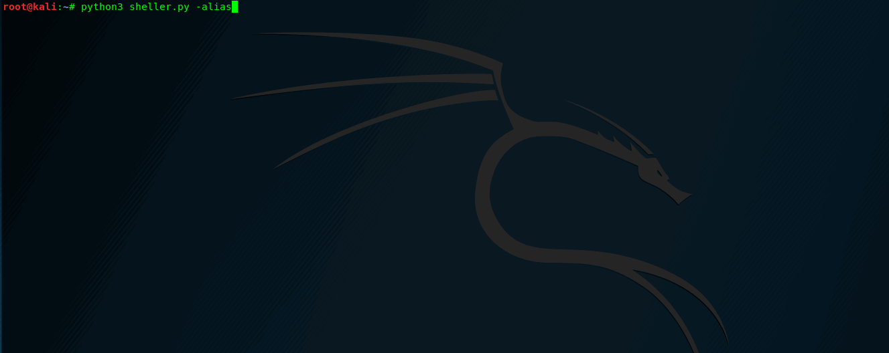

# sheller - Reverse-Shell Payload Generator
A small and simple script for pentesters, lets you easily get the payload for your remote shell.
Supports (yet):
* Python
* Perl
* Bash
* PHP
* Ruby
* Netcat
* Java

  

  
* Supports alias, after "python3 sheller.py -alias" you can run it from any directory  

