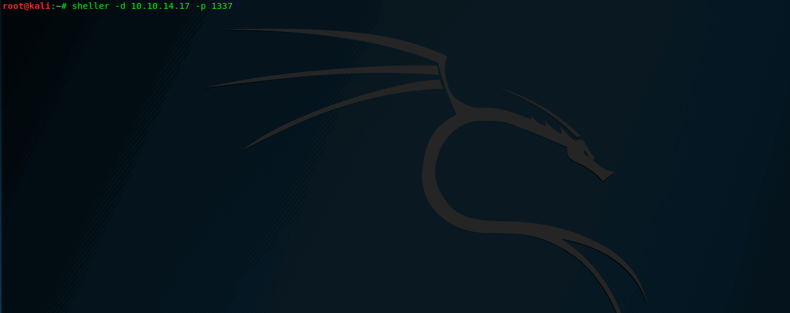

# sheller - Reverse-Shell Payload Generator   


   

A small and simple script for pentesters, lets you easily get the payload for your remote shell.
Supports (yet):
* Python
* Perl
* Bash
* PHP
* Ruby
* Netcat
* Java   

## Usage & Examples   
Without symlink:   
```
python3 sheller.py --help
python3 sheller.py -setup  # Will create the symlink
```   

With symlink:   

```
sheller -i eth0 -p 1337
# ^ Creates payloads for interface eth0 & Port 1337

sheller -d 10.10.14.13 -p 4444
# ^ Creates payloads for IP 10.10.14.13 & Port 1337   

sheller -i eth0 -p 1339 | grep python   
# ^ Shows only python payload
```


  
